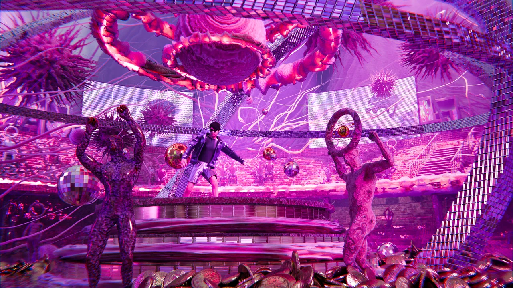
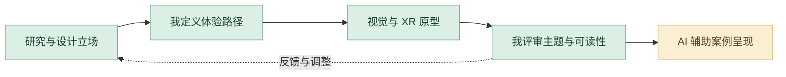

# 病名异化实验场

疾病污名研究、XR 体验路径与虚拟视觉原型。

**[完整设计案例](https://xiongzhiyuan-portfolio.pages.dev/zh/work/stigma/) · [求职作品总入口](https://github.com/Zhiyuan-Xiong/xiongzhiyuan-portfolio)**

## 项目目标

疾病如何从一个人的处境，变成社会评价中的标签？项目围绕污名化、娱乐化与浪漫化三个层面，用连续的交互情境呈现标签如何形成，并影响个体的机会与自我表达。

## 我的贡献

交互体验与视觉设计（协作项目）

完成阶段：研究、XR 体验设计与装置原型

现有产出：体验路径、交互机制、虚拟场景与直播视觉

## 设计制作与 AI 协作工作流

从疾病标签的形成机制推导交互体验。我参与交互体验与视觉设计；当前 AI 协作帮助研究复盘、体验结构表达和数字案例组织，团队职责保留在案例中。

| 阶段 | 制作、判断与 AI 协作 |
| --- | --- |
| **1. 从社会问题建立设计立场** | 围绕污名化、娱乐化与浪漫化拆分研究问题，关注标签怎样影响个体的机会与表达。先明确体验希望参与者感知什么，再决定场景与视觉。 |
| **2. 研究整理与个人判断** | 对照已有研究、案例图像与体验资料，借助 AI 整理概念与章节关系。由我检查原意、论证和参与者视角，避免用统一标签替代复杂的个人处境。 |
| **3. 将主题转为交互路径** | 把研究问题组织为连续情境、参与行为与反馈机制。比较空间、直播视觉和虚拟场景如何共同表达标签的形成过程。 |
| **4. 视觉原型与团队协作** | 参与交互体验和视觉设计，与团队共同推进 XR 与装置原型。评审画面、信息层级和情境转换，让体验关系与主题表达一致。 |
| **5. Codex 辅助数字案例** | 当前作品集将过程资料、角色职责、场景图像与机制说明转为结构清晰的网页案例。AI 帮助组织与实现，我决定叙述顺序和展示重点。 |
| **6. 专业评审与迭代反馈** | 把理解障碍拆为研究解释、体验路径或视觉层级问题，回到原案例、Chat 或 Codex 继续调整。交付体验路径、虚拟场景、视觉资料与团队分工说明。 |

### 审美与专业评审

| 评审维度 | 我的专业判断 |
| --- | --- |
| **主题表达** | 交互机制与研究问题相互对应。 |
| **体验连续** | 参与行为、场景转换和反馈可理解。 |
| **职责清晰** | 标注我参与的体验与视觉设计以及团队协作。 |

**过程证据：** [研究、场景与过程资料](media/restored/) · [数字案例组件](site-source/components/StigmaCase.astro) · [项目职责与章节](case-data.json)

[阅读完整的项目工作流](工作流.md) · [我的 AI 设计方法](https://github.com/Zhiyuan-Xiong/xiongzhiyuan-portfolio/blob/main/docs/AI设计工作流.md)

## 仓库内容

- [media/restored/](media/restored/)：案例中的公开图像资料。
- [images/](images/)：作品集封面与不同尺寸展示图。
- [site-source/](site-source/)：对应案例文案、页面组件与相关交互实现。
- [case-data.json](case-data.json)：项目目标、职责、章节与产出信息。

## 查看与使用

GitHub 中可直接浏览图像、GIF、文案与实现文件。完整交互与影像观看入口为顶部的在线案例。网页组件的完整构建环境位于 [作品集总仓库](https://github.com/Zhiyuan-Xiong/xiongzhiyuan-portfolio)。

## 署名与使用

作品素材用于个人设计展示。协作项目以案例中的职责说明为准；字体、引擎和第三方资料遵循各自授权。未经许可，不将作品素材用于转载或商业用途。
