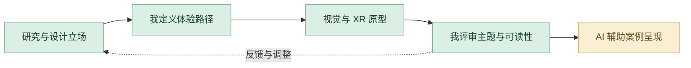

# 病名异化实验场｜详细设计与 AI 协作工作流

从疾病标签的形成机制推导交互体验。我参与交互体验与视觉设计；当前 AI 协作帮助研究复盘、体验结构表达和数字案例组织，团队职责保留在案例中。

## 1. 从社会问题建立设计立场

围绕污名化、娱乐化与浪漫化拆分研究问题，关注标签怎样影响个体的机会与表达。先明确体验希望参与者感知什么，再决定场景与视觉。

## 2. 研究整理与个人判断

对照已有研究、案例图像与体验资料，借助 AI 整理概念与章节关系。由我检查原意、论证和参与者视角，避免用统一标签替代复杂的个人处境。

## 3. 将主题转为交互路径

把研究问题组织为连续情境、参与行为与反馈机制。比较空间、直播视觉和虚拟场景如何共同表达标签的形成过程。

## 4. 视觉原型与团队协作

参与交互体验和视觉设计，与团队共同推进 XR 与装置原型。评审画面、信息层级和情境转换，让体验关系与主题表达一致。

## 5. Codex 辅助数字案例

当前作品集将过程资料、角色职责、场景图像与机制说明转为结构清晰的网页案例。AI 帮助组织与实现，我决定叙述顺序和展示重点。

## 6. 专业评审与迭代反馈

把理解障碍拆为研究解释、体验路径或视觉层级问题，回到原案例、Chat 或 Codex 继续调整。交付体验路径、虚拟场景、视觉资料与团队分工说明。

## 审美与专业评审

| 评审维度 | 我的专业判断 |
| --- | --- |
| **主题表达** | 交互机制与研究问题相互对应。 |
| **体验连续** | 参与行为、场景转换和反馈可理解。 |
| **职责清晰** | 标注我参与的体验与视觉设计以及团队协作。 |

## 操作、输入输出与指令控制

我先用完整的任务说明建立上下文：交代项目目标、参考资料、审美方向、实现约束、输出格式与验收标准，让 ChatGPT 和 Codex 理解要完成什么。得到初步方案或原型后，我再以精准的短指令逐轮控制修改，明确本轮改什么、保留什么，并对照实际结果继续判断。**完整指令建立方向，短指令控制细节，专业判断决定交付。**

| 操作阶段 | 输入 | 我的控制与 AI 协作 | 输出与验收 |
| --- | --- | --- | --- |
| 建立方向 | 社会议题、研究、团队体验资料 | 我定义设计目标，AI 辅助当前资料整理 | 明确主题与范围，核对原资料 |
| 组织方案 | 研究、参考与既有成果 | 我决定结构、视觉与专业约束 | 方案与任务；检查逻辑是否成立 |
| 专业制作 | 明确的设计方案 | 原作依照专业工具和团队分工完成 | 模型、场景或体验；由我核对效果 |
| 数字原型 | 作品资料、完整页面说明 | Codex 辅助当前网页与交互呈现 | 可浏览案例；核对原项目表达 |
| 精准迭代 | 页面、录屏与具体问题 | 短指令限定 主题含义、参与行为与信息层级 | 局部更新；与前轮和原参考对照 |
| 验收交付 | 通过评审的内容与实现 | 我核对完整性、职责和观看顺序 | 研究章节、场景与明确的团队职责 |

本段说明原项目的专业制作与当前 AI 辅助数字案例整理。修改前保留已有方案，以明确的修改对象和验收条件控制本轮结果。

## 过程证据

[研究、场景与过程资料](media/restored/) · [数字案例组件](site-source/components/StigmaCase.astro) · [项目职责与章节](case-data.json)

[项目原说明](README.md) · [完整 AI 方法](https://github.com/Zhiyuan-Xiong/xiongzhiyuan-portfolio/blob/main/docs/AI设计工作流.md)
